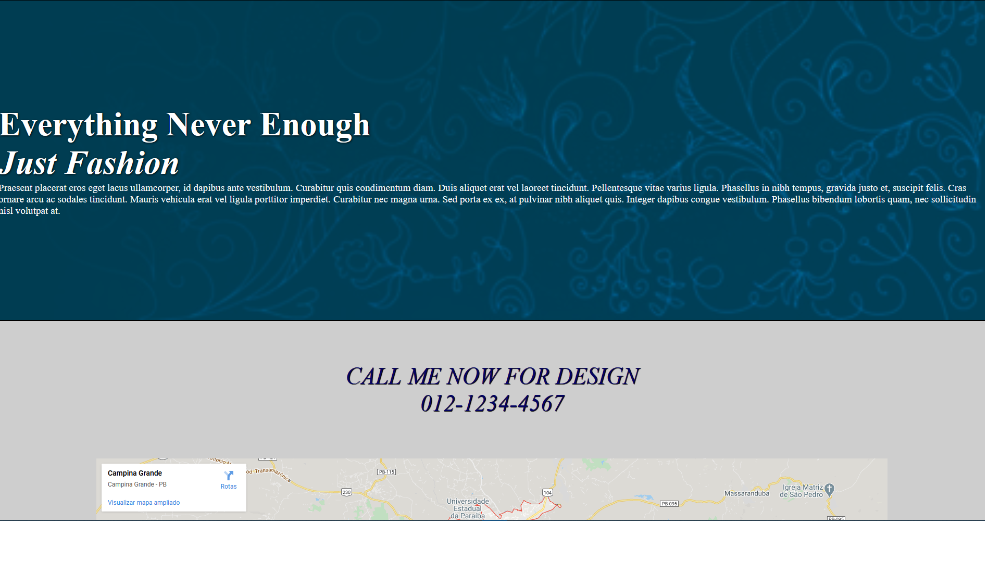

# web-design-daniel-tapias
Projects developed during the <a href="https://www.udemy.com/course/curso-web-design-fundamentos-aprenda-html-css-e-javascript/">Modern Web Design Course by Daniel Tapias.</a>
  
Projetos desenvolvidos ao longo do <a href="https://www.udemy.com/course/curso-web-design-fundamentos-aprenda-html-css-e-javascript/">Curso Web Design: HTML5, CSS3 e JS by Daniel Tapias.</a>

<h1>Preview Project 01<h1>
  

<h1>Preview Project 02<h1>
  
  
 
<h1>Preview Project 03<h1>
  
  
  
  
  
  
  
